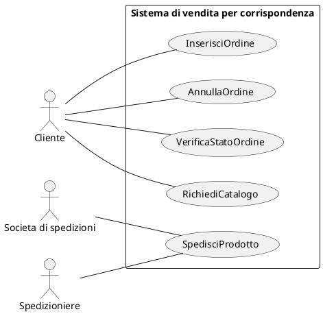
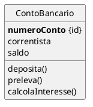
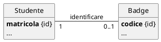
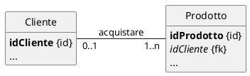
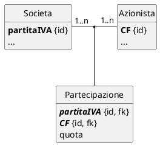
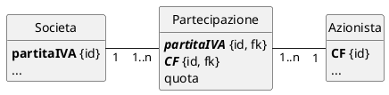

```plantuml
@startuml esempioAss11Conc
hide circle
hide methods
hide attributes

left to right direction

class Studente
class Badge

Studente "1" -- "0..1" Badge: identificare
@enduml
```

```plantuml
@startuml esempioAss11Ristr2
hide circle
hide methods

left to right direction

class Studente {
    **matricola** {id}
    codice
    ...
}
@enduml
```

```plantuml
@startuml esempioAss1nConc
hide circle
hide methods
hide attributes

left to right direction

class Cliente {
  **idCliente** {id}
  ...
}
class Prodotto {
  **idProdotto** {id}
}

Cliente "0..1" -- "1..n" Prodotto: acquistare
@enduml
```

```plantuml
@startuml esempioAssnnConc
hide circle
hide methods
hide attributes

class Societa {
  **partitaIVA** {id}
  ...
}
class Azionista {
  **CF** {id}
  ...
}

Societa "1..n" - "1..n" Azionista: Partecipazione
@enduml
```

# Manuale d'Informatica per l'Esame di Stato

## Progettazione dell’applicazione

### Specifiche dei Requisiti - Diagramma dei casi d’uso

<div hidden>


</div>


## Progettazione dei dati

### Diagramma delle classi

#### Classe

<div hidden>


</div>


#### Associazione

##### Associazione uno a uno 

###### Progettazione concettuale - Classi di analisi

<div hidden>


</div>


###### Progettazione logica - Classi di progettazione

<div hidden>


</div>


###### Ristrutturazione nel modello logico relazionale

<div hidden>


</div>


###### Schema logico

```text
Studente(matricola <PK>, codiceBadge, …)
```

###### DDL - SQL

```sql
CREATE TABLE Studente (
	matricola INTEGER PRIMARY KEY,
	codiceBadge INTEGER,
	…
);
```

##### Associazione uno a molti 

###### Progettazione concettuale - Classi di analisi

<div hidden>


</div>


###### Progettazione logica - Classi di progettazione

<div hidden>


</div>


###### Schema logico

```text
Cliente(idCliente <PK>, …)
Prodotto(idProdotto <PK>, idCliente <FK>, …)
```

###### DDL - SQL

```sql
CREATE TABLE Cliente (
	idCliente INTEGER PRIMARY KEY,
	…
);
CREATE TABLE Prodotto (
	idProdotto INTEGER PRIMARY KEY,
	idCliente INTEGER FOREIGN KEY REFERENCES Cliente(idCliente),
	…
);
```

##### Associazione molti a molti

###### Progettazione concettuale - Classi di analisi

<div hidden>


</div>


###### Progettazione logica - Classi di progettazione

<div hidden>


</div>


###### Ristrutturazione nel modello logico relazionale

<div hidden>


</div>


###### Schema logico

```text
Societa(partitaIVA <PK>, …)
Azionista(CF <PK>, …)
Partecipazione(partitaIVA <PK, FK>, CF <PK, FK>, quota)
```

###### SQL

```sql
CREATE TABLE Societa (
	partitaIVA TEXT PRIMARY KEY CHECK (length(partitaIVA) = 11),
	…
);
CREATE TABLE Azionista (
	CF TEXT PRIMARY KEY CHECK (length(CF) = 16),
	…
);
CREATE TABLE Partecipazione (
	partitaIVA TEXT REFERENCES Societa(partitaIVA),
	CF TEXT REFERENCES Azionista(CF),
	quota REAL,
	PRIMARY KEY(partitaIVA, CF)
);
```

## SQL

### Tipi di dato

#### SQLite

- **``INTEGER``** Valore intero con segno.

- **``REAL``** Valore numerico "reale".

- **``TEXT``** Una stringa di caratteri.

- **``BLOB``** (Binary Large OBject) Una rappresentazione binaria di un qualunque file.

#### Altri possibili tipi

- **``BOOL``** ``FALSE`` o ``TRUE``. In SQLite si usa ``INTEGER`` con la convenzione per cui ``FALSE = 0`` e ``TRUE = 1``
- **``DATE``** Conserva la data. In SQLite possiamo usare ``TEXT`` con date scritte secondo lo standard ISO 8601: "YYYY-MM-DD".
- **``DATETIME``**. Conserva l'istante temporale. In SQLite possiamo usare ``TEXT`` e lo standard ISO 8601: "YYYY-MM-DD HH:MM:SS.SSS".
