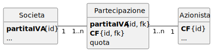

# Progettazione dell’applicazione

## Specifiche dei Requisiti - Diagramma dei casi d’uso

<div hidden>


</div>


## Progettazione dei dati

### Diagramma delle classi

#### Classe

<div hidden>


</div>


#### Associazione

##### Associazione uno a uno 

###### Progettazione concettuale - Classi di analisi

<div hidden>


</div>


Letture dell'associazione:

- Uno studente può essere identificato da un badge
- Un badge identifica uno (ed un solo) studente


###### Progettazione logica - Classi di progettazione

<div hidden>


</div>


###### Ristrutturazione nel modello logico relazionale

<div hidden>


</div>


###### Schema logico

```text
Studente(matricola <PK>, codiceBadge, …)
```

###### DDL - SQL

```sql
CREATE TABLE Studente (
	matricola INTEGER PRIMARY KEY,
	codiceBadge INTEGER,
	…
);
```

##### Associazione uno a molti 

###### Progettazione concettuale - Classi di analisi

<div hidden>


</div>


###### Progettazione logica - Classi di progettazione

<div hidden>


</div>


###### Schema logico

```text
Cliente(idCliente <PK>, …)
Prodotto(idProdotto <PK>, idCliente <FK>, …)
```

###### DDL - SQL

```sql
CREATE TABLE Cliente (
	idCliente INTEGER PRIMARY KEY,
	…
);
CREATE TABLE Prodotto (
	idProdotto INTEGER PRIMARY KEY,
	idCliente INTEGER FOREIGN KEY REFERENCES Cliente(idCliente),
	…
);
```

##### Associazione molti a molti

###### Progettazione concettuale - Classi di analisi

<div hidden>


</div>


###### Progettazione logica - Classi di progettazione

<div hidden>


</div>


###### Ristrutturazione nel modello logico relazionale

<div hidden>


</div>



###### Schema logico

```text
Societa(partitaIVA <PK>, …)
Azionista(CF <PK>, …)
Partecipazione(partitaIVA <PK, FK>, CF <PK, FK>, quota)
```

### Ristrutturazione del modello concettuale in quello logico relazionale

1. ogni *entità* diventa una *relazione*, ossia una tabella SQL;
2. ogni *attributo* di  un’entità  diventa  un  *attributo*  della  relazione,  cioè  il  nome  di  una  colonna della tabella SQL;
3. ogni *attributo* della relazione eredita le caratteristiche dell’attributo dell’entità da cui deriva;
4. l’identifi catore univoco di un’entità diventa la chiave primaria della relazione derivata;
5. l’associazione uno a uno  diventa un’unica  relazione  che  contiene  gli  attributi  della  prima e della seconda entità, salvo alcune eccezioni;
6. l’associazione uno a molti viene rappresentata aggiungendo, agli attributi dell’entità che svolge il ruolo a molti, l’identifi catore univoco dell’entità che svolge il ruolo a unonell’associazione. Questo identificatore, che prende il nome di chiave esterna dell’entità associata, è costituito dall’insieme di attributi che compongono la chiave dell’entitàa uno dell’associazione. Gli eventuali attributi dell’associazione vengono inseriti nella relazione che rappresenta l’entità a molti, assieme alla chiave esterna;
7. l’associazione molti a molti  diventa  una  nuova  relazione  (in  aggiunta  alle  relazioni  derivate dalle entità) composta dagli identifi catori univoci delle due entità e dagli eventuali attributi dell’associazione. La chiave della nuova relazione è formata dall’insieme di attributi che compongo le chiavi delle due entità, oltre agli eventuali attributi dell’associazione necessari a garantire l’unicità delle n-uple nella relazione ottenuta. 


###### SQL

```sql
CREATE TABLE Societa (
	partitaIVA TEXT PRIMARY KEY CHECK (length(partitaIVA) = 11),
	…
);
CREATE TABLE Azionista (
	CF TEXT PRIMARY KEY CHECK (length(CF) = 16),
	…
);
CREATE TABLE Partecipazione (
	partitaIVA TEXT REFERENCES Societa(partitaIVA),
	CF TEXT REFERENCES Azionista(CF),
	quota REAL,
	PRIMARY KEY(partitaIVA, CF)
);
```

## SQL

### Tipi di dato

#### SQLite

- **``INTEGER``** Valore intero con segno.

- **``REAL``** Valore numerico "reale".

- **``TEXT``** Una stringa di caratteri.

- **``BLOB``** (Binary Large OBject) Una rappresentazione binaria di un qualunque file.

#### Altri possibili tipi

- **``BOOL``** ``FALSE`` o ``TRUE``. In SQLite si usa ``INTEGER`` con la convenzione per cui ``FALSE = 0`` e ``TRUE = 1``
- **``DATE``** Conserva la data. In SQLite possiamo usare ``TEXT`` con date scritte secondo lo standard ISO 8601: "YYYY-MM-DD".
- **``DATETIME``**. Conserva l'istante temporale. In SQLite possiamo usare ``TEXT`` e lo standard ISO 8601: "YYYY-MM-DD HH:MM:SS.SSS".

### Sintassi Base - SELECT in SQLite

Le parentesi quadre (`[` e `]`) indicano l'opzionalità.

```sql
SELECT colonne
[FROM tabella]
[WHERE condizione]
[GROUP BY colonne_raggruppamento]
[HAVING condizione_raggruppamento]
[ORDER BY colonne_ordinamento [ASC|DESC]]
[LIMIT numero [OFFSET inizio]];
```

```ebnf
colonne := espressione [, espressione]*
espressione := nome_colonna |
               letterale |
               espressione AS nome |
               espressione + espressione |
               espressione - espressione |
               espressione * espressione |
               espressione / espresssione |
               min(espressione) |
               max(espressione) |
               count(espressione) |
               avg(espressione) |
               espressione = espressione |
               espressione <> espressione |
               espressione <= espressione |
               espressione < espressione |
               espressione >= espressione |
               espressione > espressione
               espressione BETWEEN espressione AND espressione;

tabella := nome_tabella |
           nome_tabella, nome_tabella |
           nome_tabella join nome_tabella clausola_join;

join := , |
        INNER JOIN |
        CROSS JOIN |
        LEFT OUTER JOIN |
        RIGHT OUTER JOIN |
        FULL OUTER JOIN |
        NATURAL JOIN;

clausola_join : ON condizione |
                USING(nome_attributo) |
                "";

condizione := FALSE | TRUE |
              condizione AND condizione |
              condizione OR condizione |
              NOT condizione |
              espressione
```

- `SELECT` *colonne*: Specifica le colonne che si desidera visualizzare nel risultato della query. È possibile specificare una o più colonne separate da virgole. Utilizzare `*` per selezionare tutte le colonne della tabella. È possibile utilizzare alias per le colonne usando la parola chiave `AS` (es. `nome_colonna AS alias`). Si possono applicare funzioni aggregate (es. `COUNT()`, `SUM()`, `AVG()`, `MIN()`, `MAX()`) alle colonne.
- [`FROM` *tabella*]: Indica la tabella o le tabelle da cui recuperare i dati. Se si interrogano più tabelle, è necessario specificarle separate da virgole (e solitamente utilizzare clausole `JOIN` ).
- [`WHERE` *condizione*]: Filtra le righe in base a una condizione specificata. La condizione può includere operatori di confronto (`=`, `>`, `<`, `>=`, `<=`, `!=`, `<>`), operatori logici (`AND`, `OR`, `NOT`), operatori `IN`, `BETWEEN`, `LIKE`, `IS NULL`, `IS NOT NULL`.
- [`GROUP BY` *colonne_raggruppamento*]: Raggruppa le righe che hanno gli stessi valori nelle colonne specificate in righe di riepilogo. Viene spesso utilizzato con funzioni aggregate per calcolare statistiche per ogni gruppo.
- [`HAVING` *condizione_raggruppamento*]: Filtra i risultati dei gruppi creati dalla clausola `GROUP BY` in base a una condizione specificata. Si differenzia da `WHERE` perché `HAVING` agisce sui gruppi, mentre `WHERE` agisce sulle singole righe.
- [`ORDER BY` *colonne_ordinamento* [`ASC`|`DESC`]]: Ordina le righe del risultato in base ai valori di una o più colonne specificate. È possibile specificare più colonne per l'ordinamento, con un ordine di precedenza da sinistra a destra.
    - `ASC` (ascendente) è l'ordine predefinito.
    - `DESC` (discendente) ordina dal valore più alto al più basso.
- [`LIMIT` *numero* [`OFFSET` *inizio*]]: Limita il numero di righe restituite dalla query. *numero* specifica il numero massimo di righe da restituire.
`OFFSET` *inizio* (opzionale) specifica il numero di righe da saltare prima di iniziare a restituire i risultati.


### Date

#### ISO 8601 (Representation of dates and times)

```YYYY-MM-DD```

date()

- Giorno: `substr('2025-04-12', 9, 2)`
- Mese: `substr('2025-04-12', 6, 2)`
- Anno: `substr('2025-04-12', 1, 4)`
- Mese corrente: `substr(date(), 6, 2)`
- Anno corrente: `substr(date(), 1, 4)`


## HTML

| Nome tag        | Descrizione                                                                 |
|-----------------|-----------------------------------------------------------------------------|
| `<html>`        | Definisce la radice di un documento HTML. Tutti gli altri elementi sono discendenti di questo tag. |
| `<head>`        | Contiene metadati sul documento HTML, come il titolo, set di caratteri, link a fogli di stile, ecc. Questi non sono visualizzati direttamente nella pagina. |
| `<title>`       | Definisce il titolo del documento, che appare nella barra del titolo del browser o nella scheda della pagina. |
| `<body>`        | Contiene il contenuto visibile del documento HTML (testo, immagini, link, ecc.). |
| `<h1>` - `<h6>` | Definiscono le intestazioni di diverso livello (da quella più importante `<h1>` a quella meno importante `<h6>`). |
| `<p>`           | Definisce un paragrafo di testo.                                              |
| `<a>`           | Definisce un hyperlink (collegamento). L'attributo `href` specifica l'URL di destinazione. |
| ``         | Inserisce un'immagine nel documento. L'attributo `src` specifica il percorso dell'immagine. |
| `<ul>`          | Definisce una lista non ordinata (con punti elenco).                          |
| `<ol>`          | Definisce una lista ordinata (con numeri o lettere).                           |
| `<li>`          | Definisce un elemento di una lista (sia ordinata che non ordinata).          |
| `<div>`         | Definisce una sezione o un contenitore generico per altri elementi HTML. Viene spesso utilizzato per scopi di layout e stilizzazione. |
| `<span>`        | Definisce una sezione o un contenitore inline generico per altri elementi HTML. Simile a `<div>`, ma per elementi inline. |
| `<table>`       | Definisce una tabella.                                                        |
| `<tr>`          | Definisce una riga all'interno di una tabella.                               |
| `<th>`          | Definisce una cella di intestazione in una tabella.                           |
| `<td>`          | Definisce una cella di dati in una tabella.                                  |
| `<form>`        | Definisce un modulo HTML utilizzato per raccogliere l'input dell'utente.     |
| `<input>`       | Definisce un campo di input all'interno di un modulo (testo, password, pulsante, ecc.). |
| `<button>`      | Definisce un pulsante cliccabile.                                           |
| `<select>`      | Definisce un menu a tendina (lista di opzioni).                               |
| `<option>`      | Definisce un'opzione all'interno di un elemento `<select>`.                  |
| `<strong>`      | Evidenzia il testo con una forte enfasi (solitamente visualizzato in grassetto). |
| `<em>`          | Enfatizza il testo (solitamente visualizzato in corsivo).                     |
| `<br>`          | Inserisce un'interruzione di riga singola.                                  |
| `<hr>`          | Definisce una linea orizzontale tematica (separatore).                       |

### Pagina web vouta - HTML

```html
<!DOCTYPE html>
<html lang="it">
<head>
    <meta charset="UTF-8">
    <title>Pagina Vuota</title>
</head>
<body>

</body>
</html>
```

### Pagina web vouta - Document Object Model

<div hidden>


</div>


### Tabella - HTML

```html
<table>
  <caption>Tabella di Esempio</caption>
  <thead>
    <tr>
      <th>Intestazione Colonna 1</th>
      <th>Intestazione Colonna 2</th>
    </tr>
  </thead>
  <tbody>
    <tr>
      <td>Dato Riga 1, Colonna 1</td>
      <td>Dato Riga 1, Colonna 2</td>
    </tr>
    <tr>
      <td>Dato Riga 2, Colonna 1</td>
      <td>Dato Riga 2, Colonna 2</td>
    </tr>
  </tbody>
  <tfoot>
    <tr>
      <td colspan="2">Nota a piè di pagina della tabella</td>
    </tr>
  </tfoot>
</table>
```

<table>
  <caption>Tabella di Esempio</caption>
  <thead>
    <tr>
      <th>Intestazione Colonna 1</th>
      <th>Intestazione Colonna 2</th>
    </tr>
  </thead>
  <tbody>
    <tr>
      <td>Dato Riga 1, Colonna 1</td>
      <td>Dato Riga 1, Colonna 2</td>
    </tr>
    <tr>
      <td>Dato Riga 2, Colonna 1</td>
      <td>Dato Riga 2, Colonna 2</td>
    </tr>
  </tbody>
  <tfoot>
    <tr>
      <td colspan="2">Nota a piè di pagina della tabella</td>
    </tr>
  </tfoot>
</table>

### Tabella - DOM

<div hidden>


</div>


## Applicazione PHP con PDO e SQLite

Questo manuale mostra un semplice esempio di come utilizzare PHP con PDO (PHP Data Objects) per interagire con un database SQLite e leggere i dati degli ordini da una tabella, per poi visualizzarli in una tabella HTML.

## Prerequisiti

* **Database SQLite:** Devi avere un database SQLite esistente con una tabella chiamata, ad esempio, `ordini`. La tabella `ordini` dovrebbe avere almeno le seguenti colonne (o simili, adattando lo script):
    * `id`: Identificatore univoco dell'ordine (INTEGER PRIMARY KEY).
    * `data_ordine`: Data dell'ordine (TEXT o INTEGER).
    * `cliente`: Nome del cliente (TEXT).
    * `prodotto`: Nome del prodotto ordinato (TEXT).
    * `quantita`: Quantità ordinata (INTEGER).

### Passaggi

1.  **Creazione del Database SQLite (se non esiste):**

    Se non hai già un database SQLite, puoi crearne uno utilizzando la riga di comando di SQLite o un tool grafico. Ad esempio, usando la riga di comando:

    ```bash
    sqlite3 mio_database.db
    ```

    Poi, crea la tabella `ordini`:

    ```sql
    CREATE TABLE ordini (
        id INTEGER PRIMARY KEY AUTOINCREMENT,
        data_ordine TEXT NOT NULL,
        cliente TEXT NOT NULL,
        prodotto TEXT NOT NULL,
        quantita INTEGER NOT NULL
    );

    INSERT INTO ordini (data_ordine, cliente, prodotto, quantita) VALUES
    ('2025-04-05', 'Mario Rossi', 'Laptop', 1),
    ('2025-04-04', 'Laura Bianchi', 'Mouse', 2),
    ('2025-04-04', 'Mario Rossi', 'Tastiera', 1),
    ('2025-04-03', 'Giovanni Verdi', 'Monitor', 1);

    .exit
    ```

    Questo creerà un file chiamato `mio_database.db` con la tabella `ordini` e alcuni dati di esempio.

2.  **Creazione del File PHP:**

    Crea un file PHP chiamato, ad esempio, `mostra_ordini.php` nella tua web directory.

3.  **Scrittura del Codice PHP:**

    ```php
    <!DOCTYPE html>
    <html lang="it">
    <head>
        <meta charset="UTF-8">
        <title>Elenco Ordini</title>
        <style>
            table {
                border-collapse: collapse;
                width: 80%;
                margin: 20px auto;
            }
            th, td {
                border: 1px solid #ddd;
                padding: 8px;
                text-align: left;
            }
            th {
                background-color: #f2f2f2;
            }
        </style>
    </head>
    <body>
        <h1>Elenco Ordini</h1>

        <?php
        // Percorso al database SQLite
        $dbFile = 'mio_database.db';

        try {
            // Connessione al database SQLite usando PDO
            $pdo = new PDO("sqlite:" . $dbFile);

            // Imposta la modalità di errore PDO su eccezioni
            $pdo->setAttribute(PDO::ATTR_ERRMODE, PDO::ERRMODE_EXCEPTION);

            // Query per selezionare tutti gli ordini
            $sql = "SELECT id, data_ordine, cliente, prodotto, quantita FROM ordini";
            $stmt = $pdo->prepare($sql);
            $stmt->execute();

            // Recupera tutti i risultati come un array associativo
            $ordini = $stmt->fetchAll(PDO::FETCH_ASSOC);

            // Verifica se ci sono ordini
            if (count($ordini) > 0) {
                echo '<table>';
                echo '<thead>';
                echo '<tr>';
                echo '<th>ID</th>';
                echo '<th>Data Ordine</th>';
                echo '<th>Cliente</th>';
                echo '<th>Prodotto</th>';
                echo '<th>Quantità</th>';
                echo '</tr>';
                echo '</thead>';
                echo '<tbody>';

                // Itera attraverso gli ordini e crea le righe della tabella HTML
                foreach ($ordini as $ordine) {
                    echo '<tr>';
                    echo '<td>' . htmlspecialchars($ordine['id']) . '</td>';
                    echo '<td>' . htmlspecialchars($ordine['data_ordine']) . '</td>';
                    echo '<td>' . htmlspecialchars($ordine['cliente']) . '</td>';
                    echo '<td>' . htmlspecialchars($ordine['prodotto']) . '</td>';
                    echo '<td>' . htmlspecialchars($ordine['quantita']) . '</td>';
                    echo '</tr>';
                }

                echo '</tbody>';
                echo '</table>';
            } else {
                echo '<p>Nessun ordine trovato.</p>';
            }

            // Chiudi la connessione
            $pdo = null;

        } catch (PDOException $e) {
            echo '<p>Errore di connessione o query: ' . $e->getMessage() . '</p>';
        }
        ?>

    </body>
    </html>
    ```

## Spiegazione del Codice PHP

* **`$dbFile = 'mio_database.db';`**: Definisce il percorso al file del database SQLite. Assicurati che questo percorso sia corretto.
* **`try...catch`**: Blocca il codice che potrebbe generare eccezioni (come errori di connessione al database o errori nella query).
* **`$pdo = new PDO("sqlite:" . $dbFile);`**: Crea un nuovo oggetto PDO per connettersi al database SQLite specificato. Il prefisso `"sqlite:"` indica il driver da utilizzare.
* **`$pdo->setAttribute(PDO::ATTR_ERRMODE, PDO::ERRMODE_EXCEPTION);`**: Imposta la modalità di gestione degli errori di PDO per lanciare eccezioni in caso di problemi. Questo è utile per il debugging.
* **`$sql = "SELECT id, data_ordine, cliente, prodotto, quantita FROM ordini";`**: Definisce la query SQL per selezionare tutte le colonne dalla tabella `ordini`.
* **`$stmt = $pdo->prepare($sql);`**: Prepara la query SQL per l'esecuzione. Anche se in questo caso la query è semplice e non contiene input esterni, la preparazione è una buona pratica per la sicurezza e l'efficienza, soprattutto con query più complesse.
* **`$stmt->execute();`**: Esegue la query preparata.
* **`$ordini = $stmt->fetchAll(PDO::FETCH_ASSOC);`**: Recupera tutte le righe risultanti dalla query come un array associativo. Ogni elemento dell'array `$ordini` è un array con chiavi corrispondenti ai nomi delle colonne della tabella.
* **`count($ordini) > 0`**: Verifica se sono stati trovati ordini nel database.
* **Creazione della Tabella HTML**: Se ci sono ordini, il codice PHP genera dinamicamente una tabella HTML (`<table>`, `<thead>`, `<tbody>`, `<tr>`, `<th>`, `<td>`) per visualizzare i dati.
* **`htmlspecialchars()`**: Questa funzione viene utilizzata per rendere sicuri i dati visualizzati nella tabella HTML, prevenendo potenziali attacchi XSS (Cross-Site Scripting) convertendo caratteri speciali HTML nelle loro entità HTML.
* **`$pdo = null;`**: Chiude la connessione al database impostando l'oggetto PDO a `null`.
* **`catch (PDOException $e)`**: Cattura qualsiasi eccezione PDO che si verifica e visualizza un messaggio di errore.

## Esecuzione

1.  Assicurati che il file `mio_database.db` si trovi nella stessa directory del file `mostra_ordini.php` (o specifica il percorso corretto).
2.  Accedi al file `mostra_ordini.php` tramite il tuo web browser (ad esempio, `http://localhost/mostra_ordini.php`, modificando `localhost` e il percorso se necessario).

Dovresti visualizzare una pagina web con una tabella HTML contenente i dati degli ordini estratti dal database SQLite. Se non ci sono ordini, verrà visualizzato il messaggio "Nessun ordine trovato." Se si verifica un errore di connessione o query, verrà mostrato un messaggio di errore.
