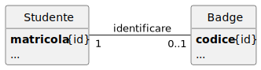
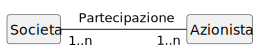

# Manuale d'Informatica per l'Esame di Stato

## Progettazione dell’applicazione

### Specifiche dei Requisiti - Diagramma dei casi d’uso

<div hidden>
```
@startuml esempioUseCase

left to right direction

actor Cliente
actor "Societa di spedizioni" AS SS
actor Spedizioniere AS SP

rectangle "Sistema di vendita per corrispondenza" {
  usecase InserisciOrdine
  usecase AnnullaOrdine
  usecase VerificaStatoOrdine
  usecase RichiediCatalogo
  
  usecase SpedisciProdotto
}

Cliente -- InserisciOrdine
Cliente -- AnnullaOrdine
Cliente -- VerificaStatoOrdine
Cliente -- RichiediCatalogo

SS -- SpedisciProdotto
SP -- SpedisciProdotto
@enduml
```
</div>


## Progettazione dei dati

### Progettazione concettuale

#### Diagramma delle classi

##### Classe

<div hidden>
```
@startuml esempioClasse
hide circle
left to right direction

class ContoBancario {
  **numeroConto** {id}
  correntista
  saldo
  
  deposita()
  preleva()
  calcolaInteresse()
}
@enduml
```
</div>


##### Associazione

###### Associazione uno a uno - Classi di analisi

<div hidden>
```
@startuml esempioAss11Conc
hide circle
hide methods
hide attributes

left to right direction

class Studente
class Badge

Studente "1" -- "0..1" Badge: identificare
@enduml
```
</div>


###### Associazione uno a uno - Classi di progettazione

<div hidden>
```
@startuml esempioAss11Ristr1
hide circle
hide methods

left to right direction

class Studente {
    **matricola** {id}
    ...
}
class Badge {
    **codice** {id}
    ...
}

Studente "1" -- "0..1" Badge: identificare
@enduml
```
</div>



###### Associazione uno a uno - Classi di analisi

<div hidden>
```
@startuml esempioAss11Ristr2
hide circle
hide methods

left to right direction

class Studente {
    **matricola** {id}
    codice
    ...
}
@enduml
```
</div>


###### Schema logico associazione 1-1

```text
Studente(matricola <PK>, codiceBadge, …)
Sintassi SQL per associazioni 1-1
```
###### Codice SQL associazione 1-1

```sql
CREATE TABLE Studente (
	matricola INTEGER PRIMARY KEY,
	codiceBadge INTEGER,
	…
);
```

###### Associazioni uno a molti - Classi di analisi

<div hidden>
```
@startuml esempioAss1nConc
hide circle
hide methods
hide attributes

left to right direction

class Cliente {
  **idCliente** {id}
  ...
}
class Prodotto {
  **idProdotto** {id}
}

Cliente "0..1" -- "1..n" Prodotto: acquistare
@enduml
```
</div>


###### Associazione uno a molti - Classi di progettazione

<div hidden>
```
@startuml esempioAss1nRistr1
hide circle
hide methods

left to right direction

class Cliente {
  **idCliente** {id}
  ...
}
class Prodotto {
  **idProdotto** {id}
  //idCliente// {fk}
  ...
}

Cliente "0..1" -- "1..n" Prodotto: acquistare
@enduml
```
</div>


###### Schema logico delle associazioni 1-n

```text
Cliente(idCliente <PK>, …)
Prodotto(idProdotto <PK>, idCliente <FK>, …)
```

###### Sintassi SQL per associazioni 1-n

```sql
CREATE TABLE Cliente (
	idCliente INTEGER PRIMARY KEY,
	…
);
CREATE TABLE Prodotto (
	idProdotto INTEGER PRIMARY KEY,
	idCliente INTEGER FOREIGN KEY REFERENCES Cliente(idCliente),
	…
);
```

###### Associazione molti a molti

###### Associazioni molti a molti - Classi di analisi

<div hidden>
```
@startuml esempioAssnnConc
hide circle
hide methods
hide attributes

left to right direction

class Cliente {
  **idCliente** {id}
  ...
}
class Prodotto {
  **idProdotto** {id}
}

Cliente "0..1" -- "1..n" Prodotto: acquistare
@enduml
```
</div>



###### Associazione molti a molti - Classi di progettazione

<div hidden>
```
@startuml esempioAss1nRistr1
hide circle
hide methods

left to right direction

class Cliente {
  **idCliente** {id}
  ...
}
class Prodotto {
  **idProdotto** {id}
  //idCliente// {fk}
  ...
}

Cliente "0..1" -- "1..n" Prodotto: acquistare
@enduml
```
</div>


###### Associazione molti a molti - Classi di progettazione

<div hidden>
```
@startuml esempioAssnnRistr2
hide circle
hide methods
hide attributes

left to right direction

class Societa {
  **partitaIVA** {id}
  ...
}
class Azionista {
  **CF** {id}
  ...
}

Societa "1..n" -- "1..n" Azionista: acquistare
@enduml
```
</div>


###### Schema logico delle associazioni 1-n

```text
Cliente(idCliente <PK>, …)
Prodotto(idProdotto <PK>, idCliente <FK>, …)
```

###### Schema logico dell’associazione n-n

```text
Societa(partitaIVA <PK>, …)
Azionista(CF <PK>, …)
Partecipazione(partitaIVA <PK, FK>, CF <PK, FK>, quota)
```

###### Sintassi SQL per associazioni n-n

```sql
CREATE TABLE Societa (
	partitaIVA TEXT PRIMARY KEY CHECK (length(partitaIVA) = 11),
	…
);
CREATE TABLE Azionista (
	CF TEXT PRIMARY KEY CHECK (length(CF) = 16),
	…
);
CREATE TABLE Partecipazione (
	partitaIVA TEXT REFERENCES Societa(partitaIVA),
	CF TEXT REFERENCES Azionista(CF),
	quota REAL,
	PRIMARY KEY(partitaIVA, CF)
);
```


